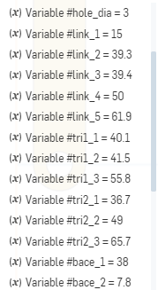
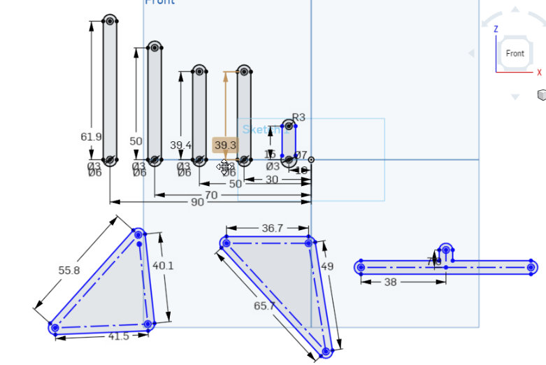
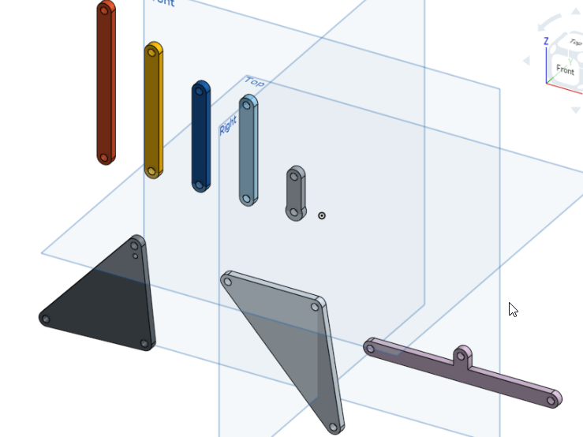
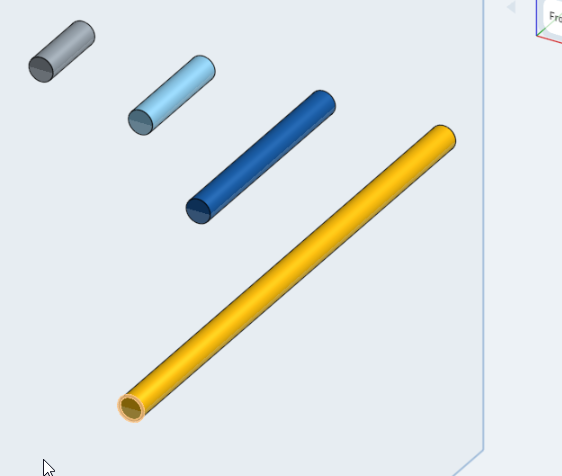
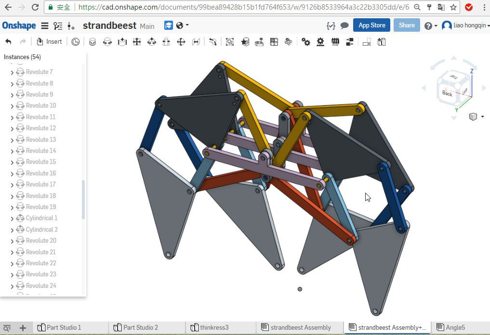

Title:2017/05/17 W13 上課筆記
Date: 2017-05-17 11:00
Category: Course
Tags: notes,w13
Slug: 2017spring-cd-W13
Author: 40423245

在Onshape中繪製行走機構所需零件，並組立各個零件

<!-- PELICAN_END_SUMMARY -->

先在Part Studio中設定好下列參數

接著繪製各零件草圖並導入參數

 

設定擠出參數為 3，並將零件擠出

 
 
 接著設定軸的半徑參數為 2 並繪製草圖，接著擠出軸，尺寸分別為 厚度X2、厚度X3、厚度X6及厚度X15
 
  
  
  接著到組合件組立行走機構，利用旋轉指令及圓柱指令結合各個零件，另用銷接指令加入軸
  
  
  
  製作動畫時只能使兩隻腳同時作動，假如要使四隻腳同時作動，可使用群組指令將兩邊的作動軸設為一個群組
  
##零件連結 ：<a href="https://cad.onshape.com/documents/99bea89428b15b1fd764f653/w/9126b8533964a3c22b3305dd/e/adbf4d9ca662915e3c139315">Strandbeest</a>

<iframe src="https://player.vimeo.com/video/218461979" width="640" height="454" frameborder="0" webkitallowfullscreen mozallowfullscreen allowfullscreen></iframe>

<a href="https://vimeo.com/218461979">40423245機械設計工程系 - 協同產品設計實習課程W13-利用Onshape繪製行走機構所需零件</a> from <a href="https://vimeo.com/user47996237">40423245</a> on <a href="https://vimeo.com">Vimeo</a>.

<iframe src="https://player.vimeo.com/video/218462899" width="640" height="454" frameborder="0" webkitallowfullscreen mozallowfullscreen allowfullscreen></iframe>

<a href="https://vimeo.com/218462899">40423245機械設計工程系 - 協同產品設計實習課程W13-在Onshape上組立行走機構</a> from <a href="https://vimeo.com/user47996237">40423245</a> on <a href="https://vimeo.com">Vimeo</a>.

<iframe src="https://player.vimeo.com/video/218468376" width="640" height="454" frameborder="0" webkitallowfullscreen mozallowfullscreen allowfullscreen></iframe>

<a href="https://vimeo.com/218468376">40423245機械設計工程系 - 協同產品設計實習課程W13-在Onshape上模擬行走機構動畫</a> from <a href="https://vimeo.com/user47996237">40423245</a> on <a href="https://vimeo.com">Vimeo</a>.

 